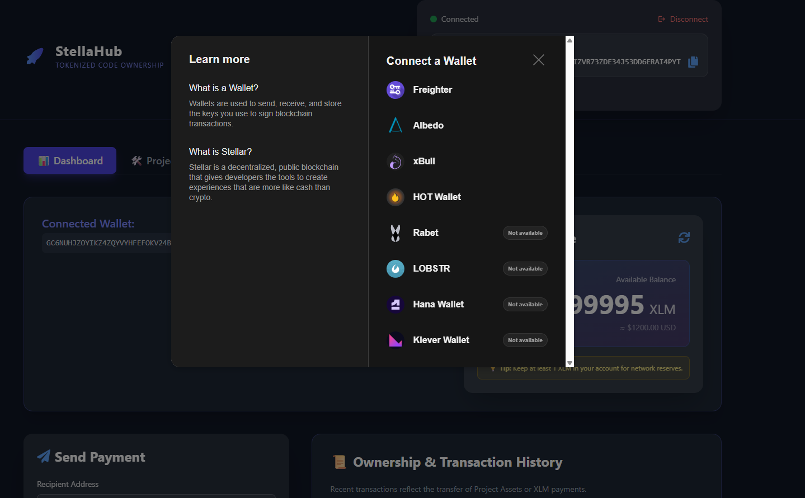
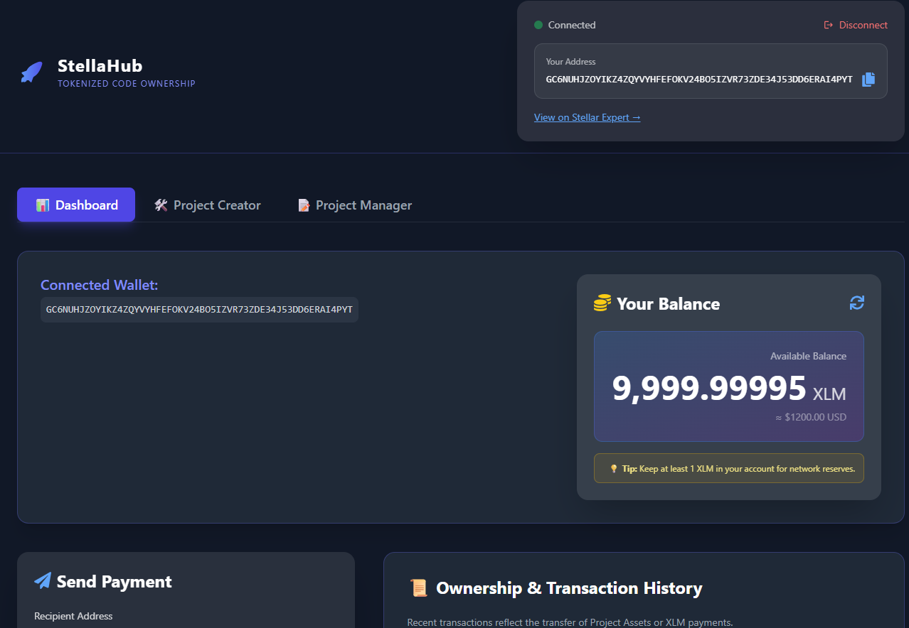
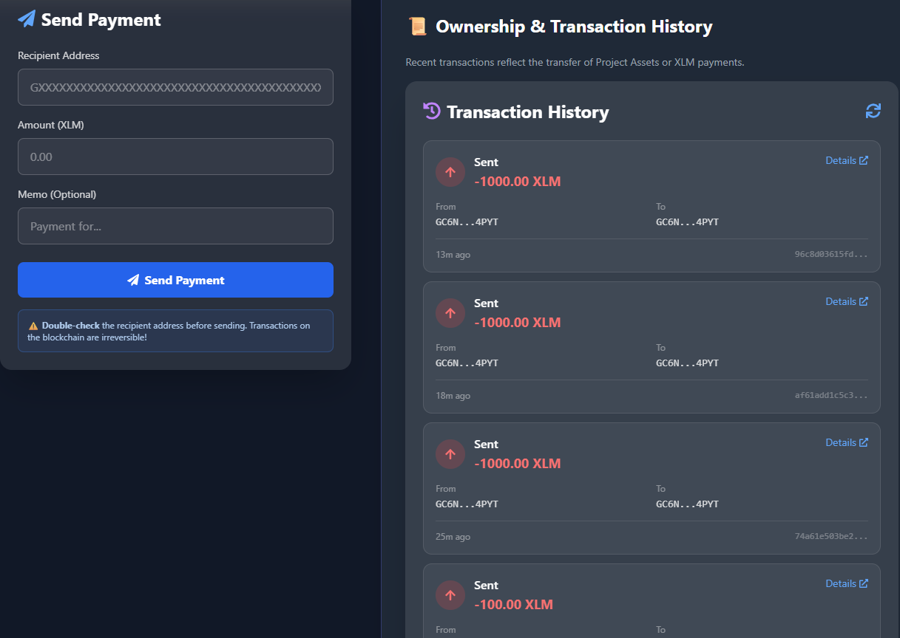
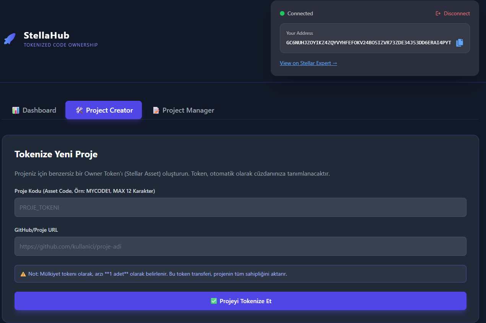
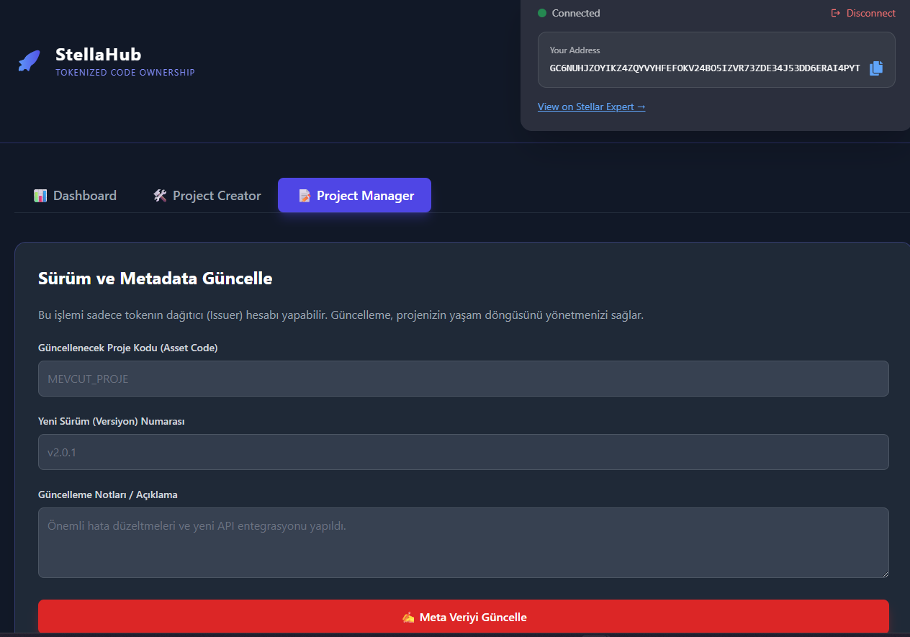

# 🚀 StellaHub: Tokenized Code Ownership System

## 🌟 Project Overview

**StellaHub** is a next-generation decentralized platform built on the **Stellar Network** that redefines software ownership, distribution, and licensing. Inspired by the functionality of platforms like GitHub, StellaHub utilizes Stellar Assets (tokens) to represent the immutable, transferable ownership of a codebase.

Instead of relying on centralized databases or complex legal escrows, ownership rights for any project are tokenized, allowing for near-instant, secure, and transparent transfer of intellectual property (IP).

### Core Concepts on Stellar

| StellaHub Concept | Stellar Mechanism | Benefit |
| :--- | :--- | :--- |
| **Project** | A Custom Stellar Asset (Token) | Unique identifier for a codebase. |
| **Ownership** | Holding the Project's "Owner Token" (Supply 1) | Instant, verifiable, and transferable legal title. |
| **Sale/Transfer** | Simple Stellar Token Transfer (Payment) | Single transaction for IP transfer or licensing. |
| **Upgrades/Versions** | Asset Metadata Update | Immutable record of project milestones, version history, or license changes. |

---

## ✨ Features

The StellaHub dashboard provides a comprehensive suite of tools for developers and investors:

### 1. 📊 Dashboard (Asset Management)
* **Wallet Integration:** Seamlessly connect and disconnect your Stellar wallet (e.g., Freighter, xBull).
* **Tokenized Project Display:** View your owned **Project Assets** (Owner Tokens) alongside your XLM balance.
* **Project Transfer:** Easily transfer (sell, gift, or license) your project's ownership token to any other Stellar public key using a simple payment transaction.
* **Ownership History:** Track all incoming and outgoing transactions related to XLM and Project Assets, providing a transparent audit trail of ownership.

### 2. 🛠️ Project Creator (Tokenization)
* **New Asset Creation:** Tokenize a new project by defining a unique **Asset Code** (Project Token ID) and linking its **GitHub/Project URL**.
* **Instant Ownership:** The newly created token is immediately assigned to your connected wallet, establishing you as the verifiable owner.

### 3. 📝 Project Manager (Metadata Control)
* **Version & Metadata Update:** For projects you issued, update the associated on-chain metadata (e.g., **Version Number, Update Notes, License Terms**). This is critical for maintaining project lifecycle transparency.
* **Issuer Control:** Ensures only the original issuer of the Project Token can perform key metadata updates, protecting the asset's integrity.

---

## 💻 Tech Stack

* **Frontend Framework:** Next.js (with React Hooks)
* **Styling:** Tailwind CSS (Modern, dark-themed, and responsive design)
* **Blockchain:** Stellar Testnet (Used for fast, low-cost asset operations)
* **Blockchain SDK:** Stellar JavaScript SDK (Implied, resides in `lib/stellar-helper.ts`)

---

## 💡 Why Stellar for Code Ownership?

Stellar is the ideal backbone for StellaHub due to:

* **Instant Settlement (3-5 seconds):** Project ownership transfers are finalized almost immediately, eliminating escrow delays.
* **Ultra-Low Fees:** Transaction fees are nominal (0.00001 XLM), making even micro-licensing models viable.
* **Native Asset Support:** Stellar treats custom assets (Project Tokens) as first-class citizens, simplifying the technical architecture required for tokenization.

---

## 🛠️ Getting Started (Testnet)

This application is currently running on the Stellar Testnet.

### Prerequisites

1.  **Stellar Wallet:** Install a compatible wallet (e.g., [Freighter](https://www.stellar.org/wallet-list)).
2.  **Clone the Repository:**
    ```bash
    git clone [YOUR_REPO_URL]
    cd stellahub
    ```
3.  **Install Dependencies:**
    ```bash
    npm install
    # or
    yarn install
    ```
4.  **Run the Project:**
    ```bash
    npm run dev
    # or
    yarn dev
    ```

### Usage Steps

1.  **Connect Wallet:** Click **"Connect Wallet"** on the top right.
2.  **Fund Account:** If your account is new, use the **Friendbot** (Stellar Testnet Faucet) to fund your account with free XLM (required for transaction fees).
3.  **Create a Project:** Navigate to the **"Project Creator"** tab, enter a unique Asset Code (e.g., `MYAPP1`), and submit the form to tokenize your code.
4.  **Transfer Ownership:** Go to the **"Dashboard"** tab, use the transfer form to send your newly created Project Token to another Stellar address.

   
   
   
   
   
   

   Drive screen recording ->https://drive.google.com/file/d/1I5MRwSfHRHa2nEFwIQHVEU0pEV7rdGPu/view?usp=sharing
